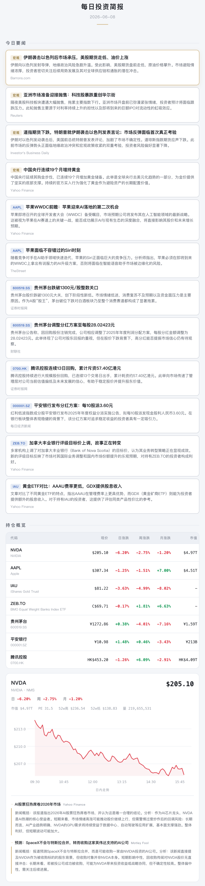

# 每日投资简报

个人晨报生成器：从 Yahoo Finance 与 akshare 拉取自选股行情，调用 LLM 做翻译/排序/解读，渲染成 HTML 邮件并发送到指定邮箱。

> English version: [README.md](README.md)

<p align="center">
  
  <br>
  <em>报告示例（顶部片段），由示例 watchlist 生成。</em>
</p>

## 功能

- **一份 watchlist 覆盖三个市场**：美股（yfinance）、港股、A 股（akshare）
- **AI 精选要闻**：每日宏观 + 个股新闻统一翻译为中文，按对你**持仓**的重要性排序，仅保留 10–15 条
- **个股深度解读**：每条相关新闻 200–300 字中文分析，区分短期/长期影响
- **邮件兼容性**：浅色仪表盘 + 行内 base64 走势图 + 无 CSS 变量 —— iOS Mail / Outlook for iOS 都能正常渲染
- **定时调度**：自带 macOS `launchd` 示例 plist，每天 09:00 触发；运行完通过 osascript 发系统通知
- **一键手动触发**：在 Finder 里双击 `run_report.command` 即可立即跑一次，不用等定时

## 依赖

- Python 3.9+
- 一个可用的 SMTP 邮箱
  - **iCloud**（推荐）：在 [appleid.apple.com](https://appleid.apple.com) 生成应用专用密码
  - **Gmail**：开两步验证后生成应用密码
  - **微软个人 Outlook 账号不再可用**：Microsoft 已将其切到 OAuth2-only，basic SMTP（含应用密码）被服务器侧拦截
- 任意 **OpenAI 兼容 LLM** 的 API key：[DeepSeek](https://platform.deepseek.com)（默认，性价比高）、[OpenAI](https://platform.openai.com)、[Groq](https://console.groq.com)，或本地 [Ollama](https://ollama.com) 实例 —— 通过 `.env` 里的 `LLM_API_KEY` / `LLM_BASE_URL` / `LLM_MODEL` 配置

## 安装

```bash
git clone https://github.com/TheGreatCBH/daily-investment-report.git
cd daily-investment-report
python3 -m venv .venv
.venv/bin/pip install -r requirements.txt
```

## 配置

```bash
cp .env.example .env
cp watchlist.example.json watchlist.json
```

编辑 `.env`：

```
# LLM — 任意 OpenAI 兼容接口
LLM_API_KEY=sk-...
LLM_BASE_URL=https://api.deepseek.com   # 留空则走 OpenAI 官方端点；默认 DeepSeek
LLM_MODEL=deepseek-chat                 # 例：gpt-4o / llama-3.3-70b-versatile / qwen2.5:7b

SMTP_HOST=smtp.mail.me.com
SMTP_PORT=587
SMTP_USER=you@icloud.com
SMTP_PASS=xxxx-xxxx-xxxx-xxxx
EMAIL_FROM=you@icloud.com

# 可选：报告语言，默认 zh-CN；设为 en-US 切换到英文输出
# REPORT_LOCALE=en-US
```

对 iCloud：`From:` 地址必须等于 iCloud 主邮箱或在 iCloud 后台验证过的别名。

`REPORT_LOCALE` 同时切换：HTML 文案、邮件主题、系统通知文案、以及 LLM 生成内容的语言（英文 prompts 在 `prompts/en/` 下）。

编辑 `watchlist.json`。symbol 沿用 yfinance 风格：

| 市场 | 例子 | 说明 |
|---|---|---|
| 美股 | `NVDA`, `AAPL` | 无后缀 |
| 美股 ETF | `IAU` | 建议加 `search_terms` 扩展新闻覆盖 |
| 多伦多 | `ZEB.TO` | `.TO` / `.V` |
| 港股 | `0700.HK` | `.HK`；新闻走 akshare 中文源 |
| 上交所 A 股 | `600519.SS` | `.SS`；行情和新闻都走 akshare |
| 深交所 A 股 | `000001.SZ` | `.SZ`；行情和新闻都走 akshare |

```json
{
  "email": { "address": "you@example.com" },
  "watchlist": [
    { "symbol": "NVDA",       "name": "NVIDIA",      "market": "NASDAQ", "type": "stock" },
    { "symbol": "600519.SS",  "name": "贵州茅台",     "market": "SH",     "type": "stock" },
    { "symbol": "0700.HK",    "name": "腾讯控股",     "market": "HK",     "type": "stock" }
  ]
}
```

`name` 字段是**主显示名**，会覆盖 yfinance / akshare 自动发现的名称 —— 你可以写"腾讯控股"而不是"Tencent Holdings Limited"。

## 运行

```bash
.venv/bin/python fetch_report.py
```

macOS 上也可以直接**双击 `run_report.command`** 立即跑一次（可把它拖到 Dock 或桌面当快捷入口）。它跑的是同一条流程，会弹出终端窗口显示进度。

整个流程：
1. 拉取 S&P 500 宏观新闻 + 每只标的的行情和新闻
2. 调用 DeepSeek 三次（要闻排序、标题翻译、个股解读）
3. 渲染 HTML 到 `reports/daily_report_YYYY-MM-DD.html`
4. 通过 SMTP 把 HTML 内嵌进邮件正文发出
5. 在 macOS 上弹系统通知（其它平台静默 skip）

> 提示：设置 `WATCHLIST_PATH=/path/to/other.json` 可指向另一份 watchlist 运行（比如脱敏 demo），无需改动真实的 `watchlist.json`。

## 定时（macOS launchd）

```bash
# 1. 把示例 plist 里的 REPO_PATH 替换为你 clone 后的绝对路径
sed "s|REPO_PATH|$(pwd)|g" examples/com.investment.daily-report.plist \
  > ~/Library/LaunchAgents/com.investment.daily-report.plist

# 2. 加载
launchctl load ~/Library/LaunchAgents/com.investment.daily-report.plist
```

默认调度是每天 09:00（本机时间）触发。若只想工作日跑，把 `StartCalendarInterval` 拆成 5 个带 `Weekday` 1–5 的 dict（plist 里有注释提示）。

改完调度后重新加载：

```bash
launchctl bootout gui/$(id -u)/com.investment.daily-report 2>/dev/null
launchctl bootstrap gui/$(id -u) ~/Library/LaunchAgents/com.investment.daily-report.plist
```

Linux / cron 版本（每天 09:00）：

```cron
0 9 * * * cd /path/to/daily-investment-report && .venv/bin/python fetch_report.py >> reports/cron.log 2>> reports/cron_error.log
```

## 架构

`fetch_report.py` 是 5 行入口，主代码在 `daily_report/`：

| 模块 | 职责 |
|---|---|
| `market_data.py` | yfinance 拉取 + 按 symbol 后缀分派到 akshare |
| `market_data_cn.py` | A 股完整 fetch（akshare）+ 港股新闻补强 |
| `news_llm.py` | DeepSeek 调用；prompts 外置在 `prompts/*.md` |
| `render_html.py` | 浅色仪表盘 CSS + 多币种感知渲染 |
| `chart.py` | matplotlib → base64 PNG 走势图 |
| `notify.py` | SMTP 邮件 + macOS osascript 通知 |
| `pipeline.py` | `main()` 流程编排 |

[CLAUDE.md](CLAUDE.md) 里有更深入的架构约定（prompt 模板规则、email-safe CSS 限制、env 加载顺序、多市场路由）。

## 已知限制

- **系统通知按平台分派 best-effort**：macOS 用 `osascript`、Linux 用 `notify-send`（需要 `libnotify-bin`）、Windows 用 PowerShell toast（Win10+），其他平台静默 skip。邮件（SMTP）全平台支持
- **微软个人 Outlook 不能作为发件方**（OAuth2-only）
- **akshare 东方财富 quote 接口在高频访问时会被限流**，所以 A 股日线主路径切到了 Sina；新闻接口（不同 endpoint）目前稳定
- **HTML 邮件 7 只标的下约 150-180KB**。多数客户端正常渲染；Gmail Web 端 >102KB 会截断并显示"查看完整邮件"链接

## License

MIT — 见 [LICENSE](LICENSE)。

## 致谢

- [yfinance](https://github.com/ranaroussi/yfinance) — 美股/港股/全球股票数据与新闻
- [akshare](https://github.com/akfamily/akshare) — A 股行情和中文财经新闻
- [DeepSeek](https://www.deepseek.com/) — 低成本的中文 LLM，兼容 OpenAI 接口
- [matplotlib](https://matplotlib.org/) — 走势图渲染
